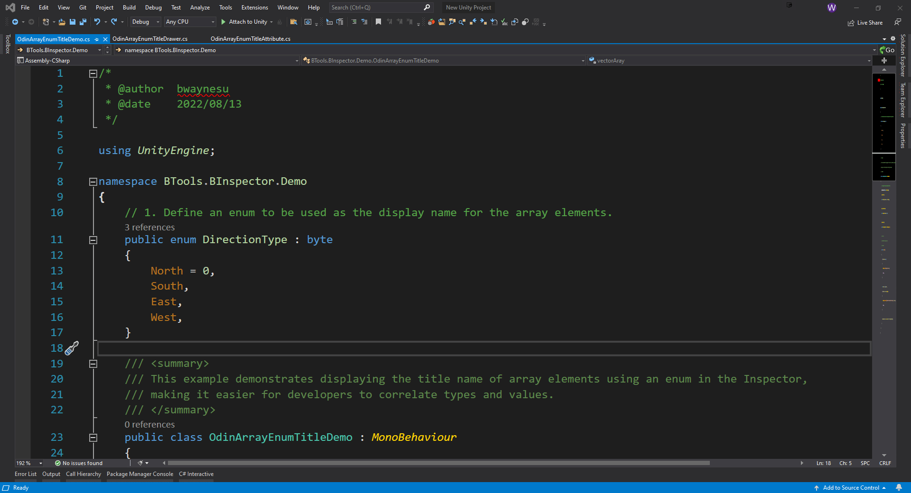

# Odin Array Enum Title

Name the elements in the array according to the enum.

> _Author: bwaynesu_  
> _Created: August 13, 2022_  
> _Tags: C#, Unity3D_

> Note: This plugin needs to be used together with the [`Odin Inspector`](https://assetstore.unity.com/packages/tools/utilities/odin-inspector-and-serializer-89041) plugin to work.

## Installation

Simply copy the folder into your Unity project.

## Tutorial

```csharp
using BTools.BInspector;

// 1. Define an enum to be used as the display name for the array elements.
public enum DirectionType : byte
{
    North = 0,
    South,
    East,
    West,
}

// 2. Designate the array to display the enum title in the Inspector
[OdinArrayEnumTitle(typeof(DirectionType))]
public Vector3[] vectorArray = new Vector3[0];
```



Please check [OdinArrayEnumTitleDemo.cs](./BInspector/Demo/OdinArrayEnumTitleDemo.cs) and Demo scene for the complete tutorial.
